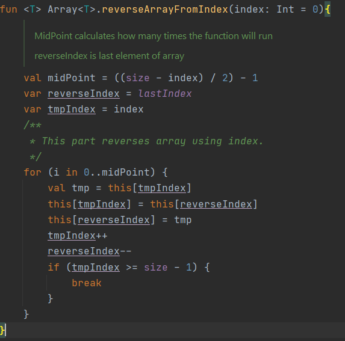

# Custom Reverse Array Extension Function
 In this function reverses the items after the incoming index

[Go to directory](https://github.com/mehmetalikirmizitas/CustomReverseArrayExtensionFunction/blob/main/app/src/main/java/com/example/customreversearrayextensionfunction/Extention.kt)

